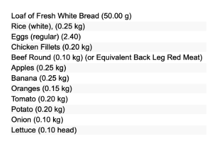

```{r setup, include=FALSE}
knitr::opts_chunk$set(echo = TRUE, message = FALSE, warning = FALSE)
```

```{r}
library(tidyverse)
library(ggplot2)
library(countrycode)
library(forcats)
library(scales)
library(viridis)
library(factoextra)
library(ggthemes)  

theme_set(theme_bw())
```

## 1 Introduction

Orianna Wang, Liz Cao, and Eric Wang, in Group Six, study the topic of the cost and affordability of healthy diets worldwide and also provide information in specific countries. In recent years, more and more people are paying attention to what food they have per day and the adequate calories required per day. The food security issue draws attention either from the public or policymakers. Food security, as defined by the Food and Agriculture Organization of the United Nations (FAO) in 1996, is “when all people, at all times, have physical and economic access to sufficient, safe, nutritious food that meets their dietary needs and food preferences for an active and healthy life” (FAO, 1996). We may all be aware that the food security issue is unbalanced. While some people can achieve adequate food requirements, others might suffer from hunger and even lose their lives because of insufficient intake. Diverse types of food are needed to sustain our healthy life. However, more nutritious and healthy food costs more. To save money, people may select less nutritious food resulting in less healthy meals. According to Afshin et al. (2019), poor diets contribute to $\frac{1}{5}$ adult deaths through insufficient and excessive intake of unhealthy food. 

## 2 Research Quesiton

To address food security issues, some approaches focused on reducing the cost of healthy diets and increasing the prices of low-nutritious and high-saturated fat snacks by adding taxes. One study found that people would eat 25% more fruits and vegetables when their costs were reduced by 50%  (Thow, Downs, Jan 2014). However, most of the policy focused on the benefits of food producers. There are many subsidy programs for farmers, but a few are considered to improve access to healthy diets. Thus, our project is designed to answer the question: in any country, when people go to grocery stores, can they find or will they purchase a diet that meets the requirements for a healthy diet? How much does it cost? Can people afford it? Does it have some relationship with the economic features? By answering these questions, we hope to shed some light on the price and affordability of healthy food that meets dietary needs and food choices for an active and sustainable life. Down the road, more actions, policies, and food aid are needed to address the food security issue in the world. 

## 3 Data Source

### 3.1 Dataset 1: Food Prices and Food Nutritions

```{r}
food_price_nutrition = read.csv("data/food_price_nutrition.csv")
food_price_nutrition
```

To compare diet costs and affordability among all countries of the world, we use Food rice and Nutritions data reported by the World Bank. The dataset contains 186 countries in the world from 2017 to 2020. These data provide information on the Cost of an energy sufficient diet [CoCA], the Cost of a healthy diet [CoHD], the Cost of nutrient adequate diet [CoNA], and also affordability. 

CoCA here is defined as the minimum cost to reach the energy requirements using the least-cost available starchy staple food in each country. According to the report, the energy requirement is set at 2329 kcal. CoHD is defined as the lowest-cost set of food items available for customers that would meet requirements set by different guidelines. CoNA is the daily lowest cost of meeting all nutrient requirements of 23 macro- and micronutrients for a person in a reference group. More details can be found at FAO 2020 report. Affordability compares food prices and income. More specifically, will people be able to afford the food they would love to purchase? 

### 3.2 Dataset 2: Income

```{r}
income = read.csv("data/income.csv")
income
```

The second dataset is about the income of countries in the world. This dataset also comes from World Bank. Except the variables demonstrating countries' basic information, such as country name and country code, it has the variable income showing the average income per capita of the country from 1960 to 2021. 

### 3.3 Data cleaning process

For the Food Price and Food Nutrition dataset, due to the lack of data, we abandoned the data from other years and only retained the data from 2017. Then, we divided all the countries in the dataset into several regions according to the UN standards stated in [Countrycode package](https://cran.r-project.org/web/packages/countrycode/countrycode.pdf) in R.

```{r}
food_price_nutrition = food_price_nutrition %>% 
  head(-5) %>% 
  select(-1, -2, -6) %>% 
  rename("Country" = "Country.Name") %>% 
  filter(Time == 2017)

food_price_nutrition = food_price_nutrition %>% 
  mutate(Region = countrycode(sourcevar = food_price_nutrition$Country.Code, origin = "iso3c", destination = "un.region.name"))

food_price_nutrition
```

For the Income dataset, as we only dealt with data from 2017, we only selected countries' 2017 income per capita. Then, we created a new variable called Group, which made for categories based on the standard of [World Bank Income Groups](https://datahelpdesk.worldbank.org/knowledgebase/articles/906519-world-bank-country-and-lending-groups).

```{r}
income = income %>% 
  select(Country.Name, Country.Code, X2017) %>% 
  mutate("Group" = ifelse(X2017 <= 1085, "Low-income",
                          ifelse(X2017 <= 4255, "Lower-middle-income",
                                 ifelse(X2017 <= 13205, "Upper-middle-income", "High-income")))) %>% 
  rename("Income" = X2017)
income
```

## 4. Results

### 4.1 Global Analysis

#### 4.1.1 Boxplot: The Cost of Different Types of Diets by Country Income Group

```{r, fig.width=9}
p1 = food_price_nutrition %>% 
  left_join(income, by = "Country.Code") %>% 
  filter(!is.na(Group)) %>% 
  select(Country, 
         Cost.of.an.energy.sufficient.diet..CoCA.,
         Cost.of.a.nutrient.adequate.diet..CoNA.,
         Cost.of.a.healthy.diet..CoHD.,
         Group,
         Region) %>% 
  rename(`Cost of an energy sufficient diet` = "Cost.of.an.energy.sufficient.diet..CoCA.",
         `Cost of a nutrient adequate diet` = "Cost.of.a.nutrient.adequate.diet..CoNA.",
         `Cost of a healthy diet` = "Cost.of.a.healthy.diet..CoHD.") %>% 
  pivot_longer(cols = c(`Cost of an energy sufficient diet`,
                        `Cost of a nutrient adequate diet`,
                        `Cost of a healthy diet`),
               names_to = c("Category"),
               values_to = "Value") %>% 
  na.omit() %>% 
  filter(Value != "..")

p1$Group = factor(p1$Group, levels = c('Low-income', 'Lower-middle-income', 'Upper-middle-income', 'High-income'))

p1 %>% 
  ggplot(aes(fill = Category)) +
  geom_boxplot(aes(x = Category,
                   y = as.numeric(Value)),
               width = 0.4) +
  geom_boxplot(aes(x = Category,
                   y = as.numeric(Value)),
               width = 0.4) +
  geom_boxplot(aes(x = Category,
                   y = as.numeric(Value)),
               width = 0.4) +
  facet_wrap(~Group, ncol = 4) +
  theme(legend.position = "top",
        axis.title.x = element_blank(),
        axis.text.x = element_blank()) +
  scale_fill_viridis(discrete = TRUE, direction = -1, option = "F") +
  labs(title = "The Cost of Different Types of Diets by Country Income Group",
       y = "2017 USD")
```

This figure shows the cost of a healthy, nutrient-adequate, and energy-sufficient diet by country income group, which is categorized based on the World Bank Atlas method. The global average cost of healthy diets is around 3 USD, while the average cost of nutrient-adequate diets is about 2 USD but below 1 USD for the average cost of energy-sufficient diets. Looking across different income groups, the median cost of healthy diets is 1.5 times more expensive than nutrient-adequate diets and 2-4 times more costly than energy-sufficient diets. It confirms our initial guess that it costs people more if they want to purchase more healthy food. One surprising finding observed from the figure is that middle-income countries have higher median costs for these three diets. Middle-income countries also have broader distributions for the cost of healthy and nutrient-adequate diets but a relatively small range for energy-sufficient diets compared to the other two income groups. Of course, no simple answer can explain why middle-income countries suffer from a higher cost and imbalance distribution. Many factors may impact food costs: supply from the agricultural market and demand from customers, natural disasters, such as drought, and also macroeconomic factors, such as unemployment rate and inflation. 


#### 4.1.2 Map: Percentage of The Population Who Cannot Afford a Healthy Diet


```{r, fig.width=9}
world_map = map_data("world")

food_price_nutrition %>% 
  filter(Percent.of.the.population.who.cannot.afford.a.healthy.diet..CoHD_headcount. != "..") %>% 
  mutate(Percentage = as.numeric(Percent.of.the.population.who.cannot.afford.a.healthy.diet..CoHD_headcount.)) %>% 
  ggplot() +
  geom_map(data = world_map,
           map = world_map,
           aes(map_id = region),
           fill = "#BDBDBD",
           color = "white",
           size = 0.2) +
  geom_map(map = world_map,
           aes(map_id = Country,
               fill = Percentage)) +
  expand_limits(x = world_map$long, y = world_map$lat) +
  labs(title = "Percentage of The Population Who Cannot Afford a Healthy Diet",
       x = "Longitude",
       y = "Latitude") +
  scale_fill_viridis(direction = -1, option = "F")
```

Since food cost affects not only the market supply-demand but also whether people can afford healthy food given their income, we dive deeper into food affordability worldwide. The dataset defines a healthy diet as unaffordable if it costs more than 52% of a household’s income. In this map, we tried to show what the distribution of affordability for healthy food looks like worldwide and which country or region faces the most severe food security issue. A high percentage of the population in low-income countries, particularly across Sub-Saharan Africa, cannot afford healthy diets. In these countries, healthy and sustainable diets are not an option for more than 75 percent of the population. This is not a surprising result; however, we need to be aware of the severity of the large percentage number and figure out how much people need to earn to meet the healthy diet requirements. 

#### 4.1.3 Scatter Plot: Affordability of A Healthy Diet vs. Income

```{r, fig.width=9}
income_temp = income %>% 
  mutate(Region = countrycode(sourcevar = income$Country.Code, origin = "iso3c", destination = "un.regionsub.name")) %>% 
  filter(!is.na(Region)) %>% 
  rename("Country" = "Country.Name")

food_price_nutrition %>% 
  filter(Time == 2017) %>% 
  filter(Affordability.of.a.healthy.diet..ratio.of.cost.to.food.expenditures..CoHD_fexp. != "..") %>% 
  filter(!is.na(Region)) %>% 
  left_join(income_temp,
            by = "Country") %>% 
  rename(Region = "Region.y") %>% 
  na.omit() %>% 
  ggplot() +
  geom_smooth(aes(x = Income,
                  y = as.numeric(Affordability.of.a.healthy.diet..ratio.of.cost.to.food.expenditures..CoHD_fexp.)),
              stat = "smooth", 
              se = FALSE,
              color = 8,
              size = 1.5) +
  geom_point(aes(x = Income,
                 y = as.numeric(Affordability.of.a.healthy.diet..ratio.of.cost.to.food.expenditures..CoHD_fexp.),
                 color = Region)) +
  scale_color_viridis(discrete = TRUE, direction = -1, option = "F") +
  labs(title = "Affordability of A Healthy Diet vs. Income",
       x = "Income",
       y = "Affordability")
```

```{r, fig.width=9}
food_price_nutrition %>% 
  filter(Time == 2017) %>% 
  filter(Affordability.of.a.healthy.diet..ratio.of.cost.to.food.expenditures..CoHD_fexp. != "..") %>% 
  filter(!is.na(Region)) %>% 
  left_join(income_temp,
            by = "Country") %>% 
  rename(Region = "Region.y") %>% 
  na.omit() %>% 
  ggplot() +
  geom_smooth(aes(x = log(Income),
                  y = as.numeric(Affordability.of.a.healthy.diet..ratio.of.cost.to.food.expenditures..CoHD_fexp.)),
              stat = "smooth", 
              se = FALSE,
              color = 8,
              size = 1.5) +
  geom_point(aes(x = log(Income),
                 y = as.numeric(Affordability.of.a.healthy.diet..ratio.of.cost.to.food.expenditures..CoHD_fexp.),
                 color = Region)) +
  scale_color_viridis(discrete = TRUE, direction = -1, option = "F") +
  labs(title = "Affordability of A Healthy Diet vs. Income (log scale)",
       x = "Income",
       y = "Affordability") 
``` 


Next, we link income and affordability of healthy diets in a narrower scope. We log-transformed income to eliminate scale issues. This downward curve indicates that a country with a higher income will have a lower affordability index, which means a smaller fraction of healthy diets relative to people’s income. This makes economic sense. For example, people in Southern Asia and Sub-Saharan Africa would need to spend all their income on purchasing healthy food, which may still be insufficient. However, for people from the right-hand side of this distribution, such as in Northern Europe, their incomes are much larger than the food cost, so they have more options and flexibility to meet health requirements. 

Also, it is worth mentioning that the relationship between the relationship between the affordability of a healthy diet and the income drops dramatically before the income reaches about 10000 USD level. And after that level, the affordability tends to decrease slowly and remain at a constant level. And this might be the case because affordability decreased to less than one after income reached 10,000. That is, for people with affordability below 1, their food expenditure is sufficient to support them to enjoy a healthy diet. So no matter how much income increases, affordability only decreases a little.

### 4.2 Case Study

#### 4.2.1 Introduction

To explore how to purchase healthy food in different countries, only analyzing the global pattern is too general. Incorporating country case studies could give insights into what purchasing healthy food is like in different countries for ordinary people. What proportion of income would people spend if they bought healthy food? Are there any barriers? We set up our case by making the following assumptions and country choices. For our case study, we focused on one day period and calculated diet cost and income for a day. The daily income (unit in USD) is derived by dividing a person’s yearly average income in a particular country by the number of days per year. We used the Recommended Minimum Amount of Money for food (2400 calories) as standard, Considering the nutrition and variation of food choice to meet the criteria for a healthy diet. In addition, to standardize our calculation in a different country, we used the same food choices below as the minimum food per day:

<center>

{width=350px}

</center>

In terms of the country choice, we chose four representative countries from each affordability group shown in our map visualization above:

+ Canada (Northern American country with low unaffordability rate), 
+ China (Eastern Asian country with lower middle unaffordability rate), 
+ Indonesia (Southeast Asian country with higher middle unaffordability rate), and 
+ Angola (African country with high unaffordability rate). 

We investigated the cost of each food type and the minimum daily cost of a healthy diet. We made visualizations using pie charts to show which food type constitutes a more significant proportion of food expenditure. Here are our results for the four countries.

#### 4.2.2 Results

##### a. Toronto - Canada 

```{r}
label = c("Milk", "Loaf of Fresh White Bread", "Rice", "Eggs", "Local Cheese", "Chicken Fillets", "Beef Round", "Apples", "Banana", "Oranges", "Tomato", "Potato", "Onion", "Lettuce")
canada = c(0.63, 0.63, 0.29, 0.61, 1.16, 1.77, 1.95, 0.96, 0.31, 0.97, 0.69, 0.55, 0.25, 0.46)
angola = c(0.62, 0.65, 0.15, 0.74, 0.55, 1.29, 2.49, 1.35, 0.19, 1.04, 0.67, 0.50, 0.22, 0.24)
china = c(0.52, 0.55, 0.13, 0.38, 1.32, 0.59, 1.92, 0.61, 0.48, 0.61, 0.31, 0.18, 0.10, 0.18)
indonesia = c(0.32, 0.29, 0.08, 0.34, 0.68, 0.52, 1.26, 0.89, 0.39, 0.63, 0.26, 0.28, 0.20, 0.22)
Canada = data.frame(Group = label, Value = canada)
Angola = data.frame(Group = label, Value = angola)
China = data.frame(Group = label, Value = china)
Indonesia = data.frame(Group = label, Value = indonesia)

Canada %>% 
  ggplot(aes(x = "",
             y = Value,
             fill = Group)) +
  geom_bar(stat = "identity",
           width = 1,
           color = "white") +
  coord_polar("y", start = 0) +
  theme(axis.title.x = element_blank(),
        axis.text.x = element_blank(),
        axis.ticks.x = element_blank(),
        axis.title.y = element_blank(),
        axis.text.y = element_blank(),
        axis.ticks.y = element_blank()) +
  scale_fill_viridis(discrete = TRUE, direction = -1, option = "F") +
  labs(title = "Distribution of Cost of A Healthy Daily Diet in Canada") 
```

##### b. Luanda - Angola 

```{r}
Angola %>% 
  ggplot(aes(x = "",
             y = Value,
             fill = Group)) +
  geom_bar(stat = "identity",
           width = 1,
           color = "white") +
  coord_polar("y", start = 0) +
  theme(axis.title.x = element_blank(),
        axis.text.x = element_blank(),
        axis.ticks.x = element_blank(),
        axis.title.y = element_blank(),
        axis.text.y = element_blank(),
        axis.ticks.y = element_blank()) +
  scale_fill_viridis(discrete = TRUE, direction = -1, option = "F") +
  labs(title = "Distribution of Cost of A Healthy Daily Diet in Angola") 
```

##### c. Beijing - China 

```{r}
China %>% 
  ggplot(aes(x = "",
             y = Value,
             fill = Group)) +
  geom_bar(stat = "identity",
           width = 1,
           color = "white") +
  coord_polar("y", start = 0) +
  theme(axis.title.x = element_blank(),
        axis.text.x = element_blank(),
        axis.ticks.x = element_blank(),
        axis.title.y = element_blank(),
        axis.text.y = element_blank(),
        axis.ticks.y = element_blank()) +
  scale_fill_viridis(discrete = TRUE, direction = -1, option = "F") +
  labs(title = "Distribution of Cost of A Healthy Daily Diet in China") 
```

##### d. Jakarta - Indonesia

```{r}
Indonesia %>% 
  ggplot(aes(x = "",
             y = Value,
             fill = Group)) +
  geom_bar(stat = "identity",
           width = 1,
           color = "white") +
  coord_polar("y", start = 0) +
  theme(axis.title.x = element_blank(),
        axis.text.x = element_blank(),
        axis.ticks.x = element_blank(),
        axis.title.y = element_blank(),
        axis.text.y = element_blank(),
        axis.ticks.y = element_blank()) +
  scale_fill_viridis(discrete = TRUE, direction = -1, option = "F") +
  labs(title = "Distribution of Cost of A Healthy Daily Diet in Indonesia")
```

#### 4.2.3 Analysis

For all four countries, the cost of protein like beef constitutes the most significant proportion of food expenditure. In Canada, chicken is more expensive compared to other countries. Cheese, an uncommon food type, costs more in China, and fruits like apples are more costly in Luanda and Jakarta. 

To show the affordability for these four countries, we defined the food income ratio as a criterion for assessment. The food income ratio is the ratio of daily food cost to daily income, where an ideal ratio should be 5-15%, considering the existence of other expenditures like rent, transportation, health expenses, etc.

After calculation, the food income ratios for the four countries are: 

+ the ratio for Canada = 9.5%, 
+ the ratio for Angola = 194.4%, 
+ the ratio for China is 33.3%, and 
+ the ratio for Indonesia 65.8%. 

Only Canada falls into the ideal ratio, and the income for people living in Angola can not even cover the cost if they choose to eat healthily. The cost in China and Indonesia is coverable. Still, way extends the recommended ratio, indicating the difficulty of people in these two countries to purchase a healthy diet with an average income. 

### 5 Limitations and open questions

As we try to show the importance of economic growth, specifically income, on food security issues worldwide, we also need to be aware of some limitations. First is the measurement and reliability of the data we used. We use GNP as a proxy of income in each country, but this index may capture a fraction of the population in the country. Second is the definition of each type of diet. Even though the data we used accounts for the cultural differences and chooses the representative dietary guidelines specific to one region, ‘healthy diets’ is such a subjective term for different countries that different definitions may lead to different results.

Lastly, observing the average and median numbers at an aggregate level hides what happens to the poorest people in the poorest countries. In other words, the aggregate result may need to be more accurate in the severity of the food security issues worldwide. Future researchers may need to disaggregate the data into a narrower and more detailed population. With that result, the policy will be more tailored and solve food issues they were supposed to solve. 

Regarding the case study, we used one common food choice and did not incorporate cultural differences to generate a more comparable result. But in reality, choosing some of the substitutes that are more accessible in the country would decrease the cost. But our result could show the overall situation and illustrate the significant problem. 

For further studies, resolving some open questions in terms of the variation is necessary:

+ The variation of the cost of healthy diets by region within the country.
+ The variation of income for countries with high GINI index with the corresponding variation in affordability for each person.
+ Variation of cost in different food types and seasonal variation. 

### 6 Contribution

+ Liz: brainstorming, literature reviews, data findings, final narrative 
+ Orianna: Researching to clear out structure and find resource papers. Perform case study analysis and help with data finding. Presentation slide.
+ Eric: Data cleaning, data visualization, formatting PowerPoint and final narrative, Github managing

### 7 Resources & References

+ Afshin, A., Sur, P. J., Fay, K. A., Cornaby, L., Ferrara, G., Salama, J. S., Mullany, E. C., Abate, K. H., Abbafati, C., Abebe, Z., Afarideh, M., Aggarwal, A., Agrawal, S., Akinyemiju, T., Alahdab, F., Bacha, U., Bachman, V. F., Badali, H., Badawi, A., … Murray, C. J. L. (2019, April 3). Health effects of dietary risks in 195 countries, 1990–2017: A systematic analysis for the global burden of disease study 2017. The Lancet. Retrieved December 13, 2022, from https://www.thelancet.com/article/S0140-6736(19)30041-8/fulltext 
+ Thow, M., Downs, S., & Jan, S. (2014). A systematic review of the effectiveness of food taxes and subsidies to improve diets: Understanding the recent evidence. Nutrition Reviews, 72(9),551-565. doi: 10.1111/nure.12123
+ Herforth, A., Bai, Y., Venkat, A., Mahrt, K., Ebel, A. & Masters, W.A. 2020. Cost and affordability of healthy diets across and within countries. Background paper for The State of Food Security and Nutrition in the World 2020. FAO Agricultural Development Economics Technical Study No. 9. Rome, FAO. https://doi.org/10.4060/cb2431en
+ Cost of living: https://www.numbeo.com/cost-of-living/
+ World Bank Income Groups: https://datahelpdesk.worldbank.org/knowledgebase/articles/906519-world-bank-country-and-lending-groups
+ Countrycode R package documentation: https://cran.r-project.org/web/packages/countrycode/countrycode.pdf

